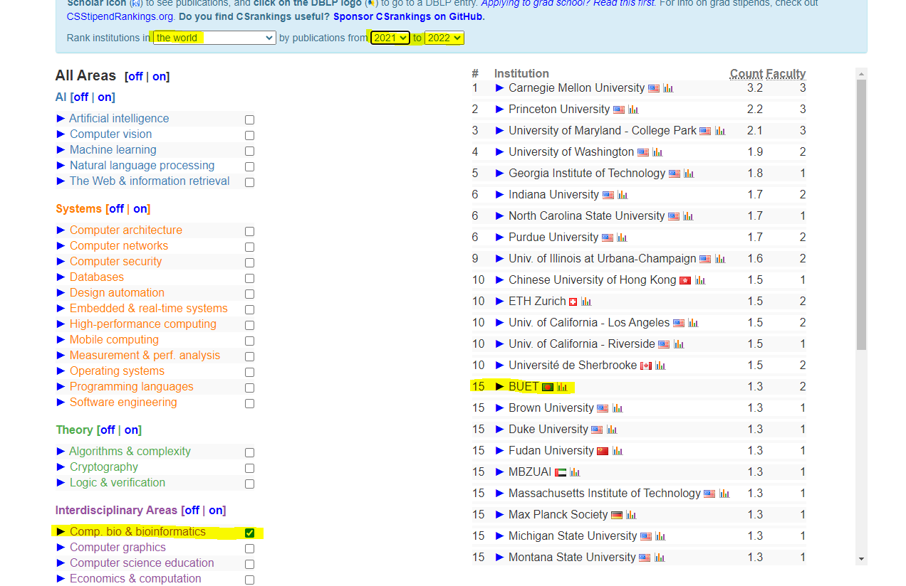
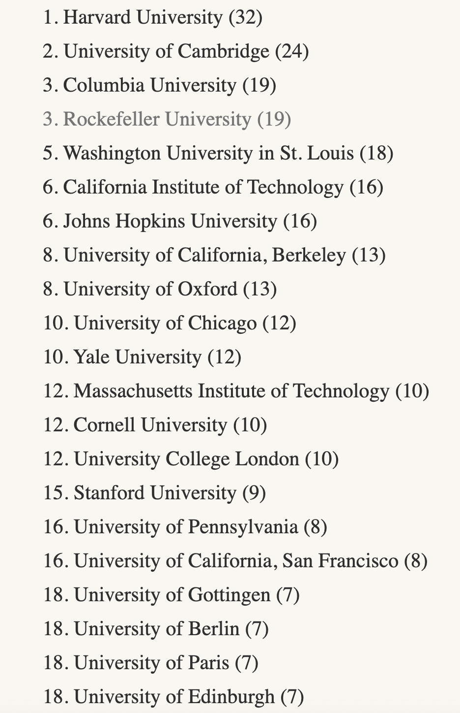

Hello Everyone. I am Saifur. I joined the WashU School of Medicine for my Ph.D in Fall 2024. I believe many others will be applying soon and I think my experience in the application in a medical school from a pure engineering background for fellow students like me can be helpful.
That's why I am writing this article to share my experience as well as a few suggestions. I hope it will come in handy for people who want to pursue their higher study in Computational Biology/Bioinformatics/Genetics and related fields. I will be writing this from a 
CS major's perspective but I believe it would be helpful for students from any background. So, let's start.

The first question any PhD applicant would ask is, WHERE SHOULD I APPLY? WHICH SCHOOLS ARE GOOD? As people like order in everything, we grad students are no different. We seek a ranking in the relevant field and I was no different. As a CS major, the first place
we would go to is [CSRankings](https://csrankings.org/) or [USNews CS Rank](https://www.usnews.com/best-graduate-schools/top-science-schools/computer-science-rankings?_sort=rank-asc). CSRankings has a filter to sort schools according to Comp. Bio. & Bioinformatics and most people tend to fall into this trap. This is a disastrous ranking for this field and let me tell you why. CSRankings ranks schools based on publications that are indexed in dblp. 

dblp is a renowned publication index in the field of CS but it does not index journals like Nature, Nature Genetics, Nature Methods or any reputed Nature journals, Science, Cell and all of its journals, PNAS, Genome Research, Genome Biology, Brain and almost all of the top journals in the field of computational biology. If you visit the profile of a big faculty in this field, you will certainly find that they all publish their work in these and many more top life science journals. CSrankings does **NOT** take publications in these venues into account! Ironically, with some appropriate filter, you can rank BUET among the top 15 schools in the world; even above MIT. So, why are you aspiring to go to MIT leaving BUET!

Okay, now back to the main point. Where can we find a reliable list of schools that are top-notch in medical research? Remember that all ranks are flawed! Still, if you want to look for a list of schools that are good in computational biology, you can look into the following list to get an idea. Look for the School of Medicine funding as most people will be interested in that field. It denotes the total research funding allocated to that school. 
- [Top NIH grant received Schools](https://www.forbes.com/sites/michaeltnietzel/2023/02/20/johns-hopkins-university-again-tops-list-of-leading-institutions-for-nih-funding/)

  Also, you can look into the all-time  total Nobel prize-winning list in the **medicine** category to get an idea about the university's reputation in this field.  

Here is some of them.

Before discussing programs into any of the school and share my experiences, I would put a cautionary note and suggestions first. Please don't apply to CS department if you are planning to come to computational biology. Look for medical schools or CS programs that have joint collaboration with medical schools. When applying you will have options to apply to Computational Biology/Bioinformatics under CS department as well as direct Comp. Bio/Bioinformatics program. I was confused to choose between them and so will be you. Most of the direct Bioinformatics programs are affiliated with Medical School while CS/Bioinformatics are affiliated with Engineering school. But why does it matter? It matters because there is a high chance that there will be no wet lab in the Engineering school and they only analyze data produced by other labs or publicly available while med schools have their own lab and can run end-to-end experiments rather than relying on data produced by others. 

But, I don't want to do wet lab work, I want to sit in front of my desk and analyze the data. I wanted the same until I had an interview with Mike Province from WashU, who changed my idea. No matter where you want to go after PhD, having both wet and dry lab experience will serve you in the long run. If you are only a anylst, chances are high that you won't be well prepared for a top position in this field cause both academia and industry want people who know how to design biological experiments, can decide on appropriate technologies to run the experiments on as well as analyze the data. In an editorial note by NEJM (*if you are wondering what this journal is, it has an impact factor of 96.2 if this gives you an idea of its reputation*), the editors called the bioinformaticians *"research parasite"* because they rely on the data produced by others and have little to no biological knowledge of the data and very often come up with a wrong conclusion from the data which can be disastrous. It's always better to work in a lab where there is both dry and wet lab and you can always focus on the dry lab part while getting some experience of the wet lab as well. This is the reason I would encourage everyone to apply to medical school rather than an engineering program ( some CS lab has their own wet lab, those are exceptions).

My second cautionary note will be to check the requirements for the specific med school programs. Some med schools have hard requirements of a double major in biology and math/CS or good enough biology requirements. Do not apply to those schools if you are a CS major as they will not even review your applications as they receive thousands of applications and can only review hundreds of them to accept 10-12 students each year. It would be a waste of your money like I did. If you are really into that school, then you have no other option but to apply to their engineering school.

Enough of cautions, let's discuss some schools and programs. I will be discussing the top ten schools from the NIH grants (See School of Medicine Section) list but by no means do I endorse this rank. I will also be suggesting a few faculties working with multiomics/genomics data. So, let's start.

**University of California San Fransico**

I am pretty sure, we all are familiar with UC Berkley, UCLA, UC San Diego. Where does UCSF come from? It is a very big name in the biotech industry. We do not know this name because this school is totally focused on biological science and has no engineering program. Look into their program for more details if you are interested but I did not apply here. 

**Stanford Universty**

No comment. If you know, you know

**WashU School Of Medicine**

This is where I will be joining. I will be joining their Computational & Systems Biology which falls under the Division of Biology & Biomedical Sciences (DBBS). DBBS includes 600+ faculties from all sectors of medical science; genetics, neuroscience, oncology, virology, epidemiology, you name it. And you can choose to work with any of these faculties. Interestingly you will complete 3 rotations in different labs and then at the end of year 1, you can choose which of those labs you want to do your PhD in. This gives you the flexibility to explore your chosen faculty and field of your own. I would be more interested in writing about WashU and my program if anyone is interested. 

**Johns Hopkins University**

They have a CS/Bioinformatics program with world-class mentors like Steven Salzberg, Ben Langmead, and Jean Fan. However, their admissions are totally faculty-driven driven and you will have to approach faculty and convince them that you are right for their lab. So, best of luck!

**University of Pennsylvania**

Ivy stuffs.

**University of Pittsburgh**

Very focused on medical sciences. I have no idea though.

**Yale University**

Ivy stuffs. Might consider Smita Krishnaswamy, Mark Gernstein, and David Van Dijk if you wanna apply.

**UCLA**

I applied to their Bioinformatics program and they did not even review my applications as I do NOT have any biology experience. The same thing happened in UMich Bioinformatics too.

Here I would discuss some other schools as well in no definite order. **University of Washington** is top-notch in this field as well with faculties like William Noble, Sara Mostofavi, Sun In Lee. However, they take very few international students. **Baylor College of Medicine** is a good choice in Texas and they have good collaboration with Rice University and MD Anderson Cancer Institute. However, I did not like the way they handled their admission procedure and interview processes. They are not organized at all. **MIT** also has Computational & Systems Biology program as well. But they take very few students and prefer biology and math/cs dual majors. So, if you want to apply to MIT, better stick to their EECS program. **Princeton** has a Quantitative & Computational Biology program as well but I would not recommend it for the same reason mentioned above, stick to their CS program. Other universities that are very highly reputed in this field are (be cautious before applying, some of them take few internationals) **Rockefeller University**, **Harvard**, **UC Berkley**, **UC San Diego**, **the University of Toronto**, **Duke**, **NYU**, **UNC Chapel Hill**, **Columbia**, **Weill Cornell** (They will ask for WES evaluated transcript), **the University of Chicago**, **CalTech**, **CSHL** 

Lastly, this might trigger some people, but I mean no offense. This is solely my own perspective and I might be very wrong. I did *NOT* find these schools interesting enough for computational biology (solely because they mostly develop computational tools without focusing on the underlying biology) even though they are very reputable in the CS field. **Carnegie Mellon University** (However, CMU-Pittsburgh Joint program is very reputated), **UIUC**, **Purdue**. 

